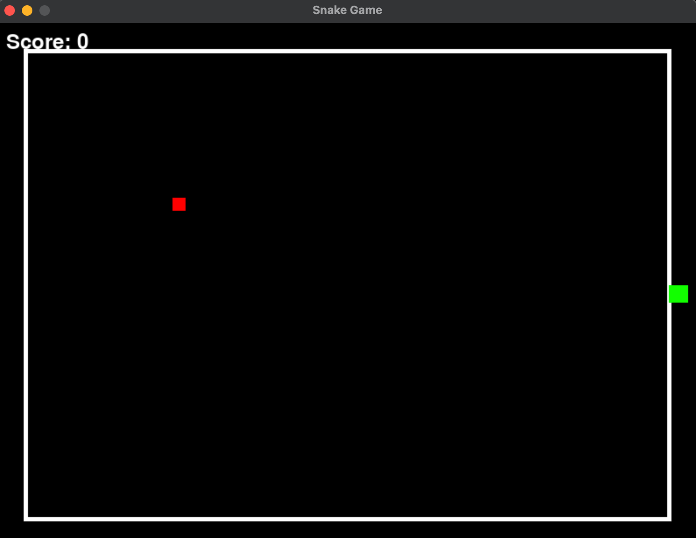
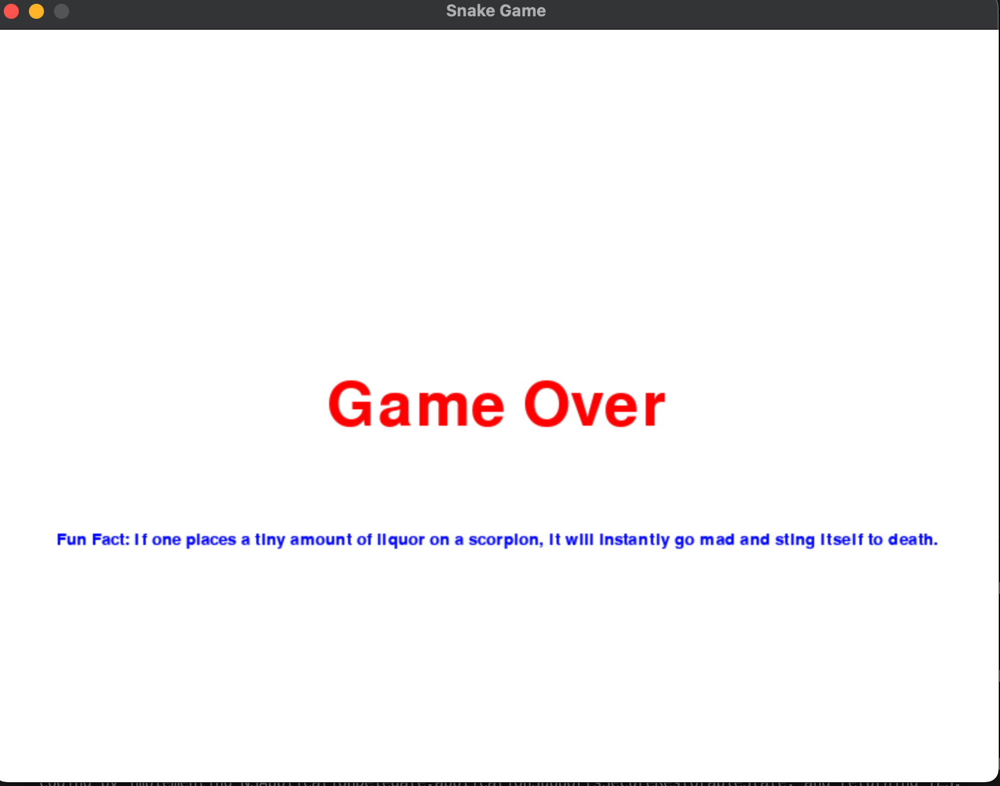

:warning: Everything between << >> needs to be replaced (remove << >> after replacing)

# Super Snake Game 
## CS110 B1 Final Project Fall , 2024 

## Team Members

## Project Description

This game is a recreation of the popular game, Snake. There will be a snake who has to go around and eat it's food and it has to try and get as big as possible without running into a wall or running into itself. 

## GUI Design

### Initial Design

### Final Design

## Program Design

### Features

1. Move the snake using the keys
2. Snake must eat food to continue growing
3. If snake runs into the wall or itself, game over
4. Uses an API to get a random fun fact when the game ends
5. Scoreboard to track the score (how much food snake has ate)

### Classes

- Snake
This snake class shows the snake in the game which is controlled by the player. The snake can be moved using the up, down, right, and left keys on the keyboard. Whenever the snake eats the food, it also grows. 
- Food
The food represents what the snake is aiming to get throughout the game. It is the purpose of the player to eat as much food and to grow the snake as large as possible without hitting a wall or running into itself. 
- Controller
The controller is used to make sure the game can run properly. It makes sure the screen is properly presented and tracks the players score as well as a clock to show the time. 
- Fun Fact API
This is a fun addition I added to meet the criteria of this project. When the game finishes, there will be a screen that says Game Over. Below this, there will be a random fun fact that I pulled from an external API. The link is attached: https://uselessfacts.jsph.pl/random.json?

## ATP

- Snake Movement
Step One: Press the Up Arrow -> Snake moves up
Step Two: Press the Right Arrow -> Snake moves right
Step Three: Press the Down Arrow -> Snake moves down
Step Four: Press the Left Arrow -> Snake moves left

Outcome: Snake moves in accordance to the keys

- Snake Eating Food
Step One: Move the snake towards food position -> Snake moves properly to the food
Step Two: Ensure snake collides with the food -> Snake grows and score increases by one
Step Three: Food dissapears -> Food relocates to new position

Outcome: Snake eating the food should make it grow and also increase the score. The food should relocate for the snake to go eat. 

- Game Over Screen
Step One: Make the snake collide with the wall -> Game should stop
Step Two: Look at the screen -> Verify there's a Game Over text on the screen

Outcome: The game should present a game over screen when the snake collides with a wall

- Random Inputs Ignored
Step One: Start the Game and press random keys (Numbers, letter etc.) -> Game continues running and doesn't crash or have bugs

Outcome: Shows that the game can ignore invalid inputs 

- Fun Fact Screen
Step One: End the game by colliding into a wall -> Game finishes
Step Two: Watch the game over screen -> Should have a random fun fact from an external API 

Outcome: There's a random fun fact after the game is ended