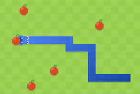

:warning: Everything between << >> needs to be replaced (remove << >> after replacing)

# Super Snake Game 
## CS110 B1 Final Project Fall , 2024 

## Team Members

## Project Description

This game is a recreation of the popular game, Snake. There will be a snake who has to go around and eat it's food and it has to try and get as big as possible without running into a wall or running into itself. 

## GUI Design

### Initial Design

### Final Design

## Program Design

### Features

1. Move the snake using the keys
2. Snake must eat food to continue growing
3. If snake runs into the wall, game over
4. If snake runs into itself, game over
5. Scoreboard to track the score (how much food snake has ate)

### Classes

- << You should have a list of each of your classes with a description >>

## ATP

| Step                 |Procedure             |Expected Results                   |
|----------------------|:--------------------:|----------------------------------:|
|  1                   | Run Counter Program  |GUI window appears with count = 0  |
|  2                   | click count button   | display changes to count = 1      |
etc...
